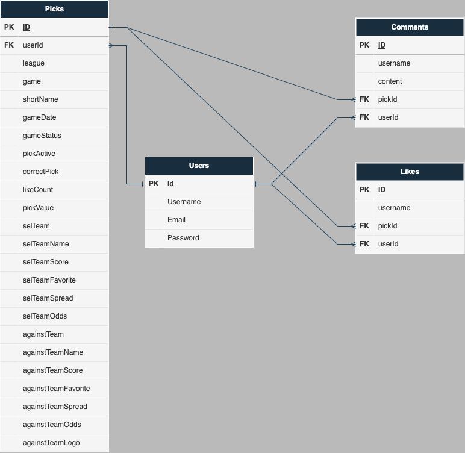
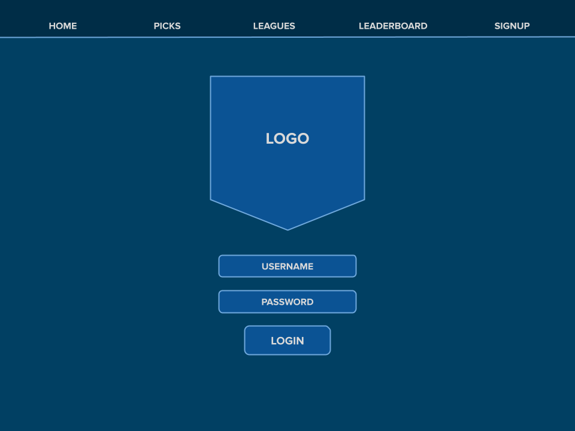
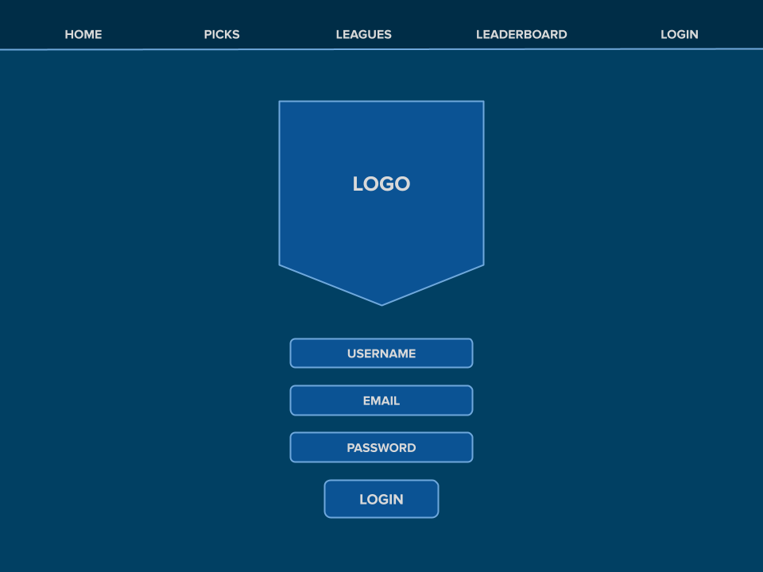
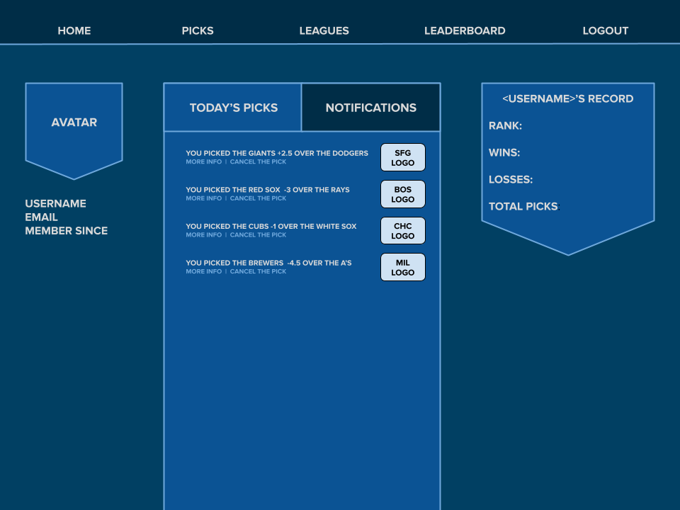
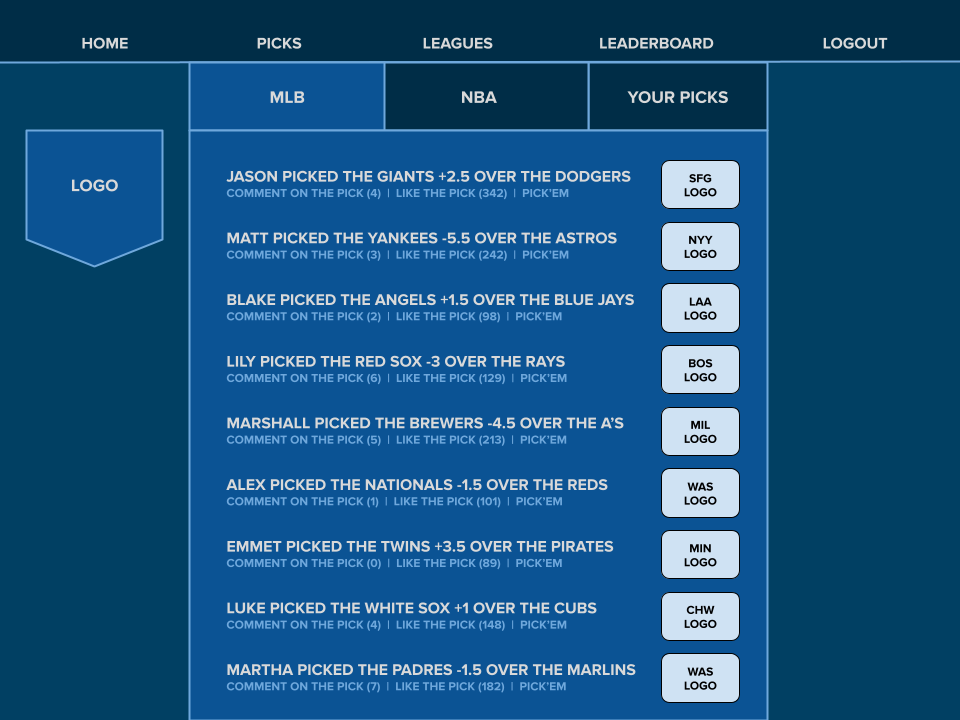
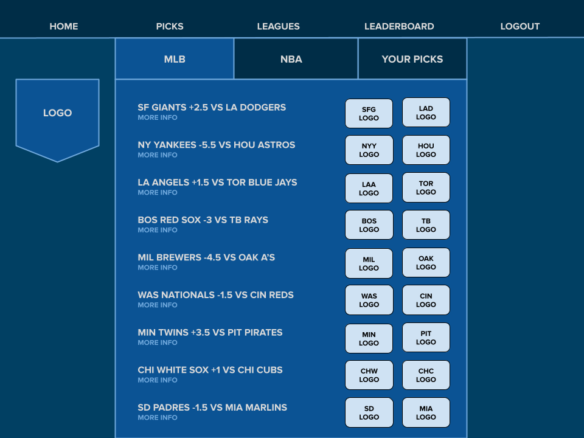
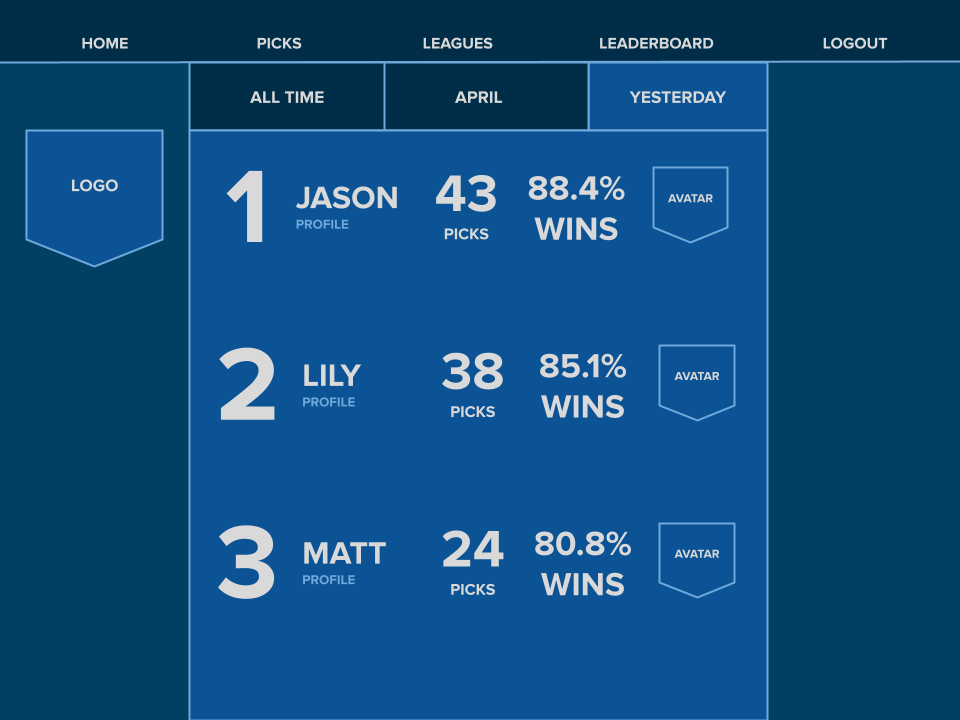

# Pick'em
### Visit the app: **[pickem.herokuapp.com](https://pickem.herokuapp.com/)**

## Background
In 2022, legal sportsbooks in the United States reached new records in handled bets ($93.2 billion) and revenue ($7.5 billion), according to the [American Gaming Association](https://www.americangaming.org/new/2022-commercial-gaming-revenue-tops-60b-breaking-annual-record-for-second-consecutive-year/). A key driver is the incremental legalization of mobile gambling. 

However, as sports betting gets more integrated into fans' lives, it remains a siloed activity that expires moments after the final whistle of a game. Pick’em seeks to change that. Sports fans and betting sharks can make their picks publicly, interact with others’ and see how he/she/they compare to the millions who enjoy sports betting.
## Tech stack
* HTML
* CSS
* JavaScript
* Node.js
* [Express framework](https://www.npmjs.com/package/express)
* [Sequelize ORM](https://www.npmjs.com/package/sequelize)
* [PostgreSQL](https://www.npmjs.com/package/postgres)
* [dot-env](https://www.npmjs.com/package/dot-env)
* [Embedded JavaScript templates](https://www.npmjs.com/package/ejs)
* ESPN API - [example](http://site.api.espn.com/apis/site/v2/sports/baseball/mlb/scoreboard)
* YouTube API (future integration)
* Front-end framework (future integration)
## Entity Relational Diagram

## Routing Chart

| HTTP METHOD | URL                     | CRUD    | Description                                                                         | View                |     |     |     |
|:----------- |:----------------------- |:------- |:----------------------------------------------------------------------------------- |:------------------- | --- | --- | --- |
| GET         | /                       | READ    | Load homepage with login form                                                       | Home / Member login |     |     |     |
|             |                         |         |                                                                                     |                     |     |     |     |
| POST        | /members/login          | READ    | Checks user credentials against database                                            |                     |     |     |     |
| GET         | /members/new            | READ    | Display signup form                                                                 | Member signup form  |     |     |     |
| POST        | /members                | CREATE  | Add member to database, redirect to members/:username/todayspicks                   |                     |     |     |     |
| GET         | /members/logout         | READ    | Logout member by clearing cookies, redirect to homepage                             |                     |     |     |     |
|             |                         |         |                                                                                     |                     |     |     |     |
| GET         | /members/profile        | READ    | Load private member profile with pick history and edit / delete picks functionality | Profile             |     |     |     |
| GET         | /members/:username      | READ    | Display public version member profile with pick history                             |                     |     |     |     |
| GET         | /members/edit/:pickId   | READ    | Loads 'change pick' page of specific pick id                                        |                     |     |     |     |
| PUT/PATCH   | /members/:pickId        | UPDATE  | Updates pick decision, redirects to /members/profile                                |                     |     |     |     |
| DELETE      | /members/:pickId        | DESTROY | Removes pick from database                                                          |                     |     |     |     |
|             |                         |         |                                                                                     |                     |     |     |     |
| GET         | /picks                  | READ    | Display feed of real-time picks of default view                                     | Picks               |     |     |     |
| GET         | /picks/:league          | READ    | Display feed of real-time picks of specific league                                  |                     |     |     |     |
| POST        | /picks/like/:pickId     | CREATE  | Create 'like' from logged-in user on pick id                                        |                     |     |     |     |
| POST        | /picks/comment/:pickId  | CREATE  | Create 'comment' from logged-in user on pick id                                     |                     |     |     |     |
|             |                         |         |                                                                                     |                     |     |     |     |
| GET         | /:league                | READ    | Display pick options from league view                                               | League              |     |     |     |
| POST        | /:league/add/:pickId    | CREATE  | Adds pick to database, redirect to /:league                                         |                     |     |     |     |
|             |                         |         |                                                                                     |                     |     |     |     |
| GET         | /leaderboard            | READ    | Displays leaderboard, default view is "yesterday"                                   | Leaderboard         |     |     |     |
| GET         | /leaderboard/:thismonth | READ    | Displays leaderboard, view is "this month"                                          |                     |     |     |     |
| GET         | /leaderboard/alltime    | READ    | Displays leaderboard, default view is "all time"                                    |                     |     |     |     |

## Wireframes
### Homepage

### Signup

### Profile

### Picks

### Leagues

### Leaderboard

## User Stories
**MVP**
- I want to see details about each sports game (teams, odds, location, time, record, probable pitchers) - modal
- I want to pick on sports games
- I want to know the status of my picks
- I want to know how successful I am at picking sports games
- I want to comment on other users pick decisions
- I want to see how successful other users are at picking sports games

**Stretch**
- I want to see a leader board of the best sports pickers
- I want to see what sports I’m best/worst at picking at
- I want to see what team I’m best/worst at picking at
- I want to click on teams and see recent news, stats, roster
- I want to know if I'm on a winning streak

## Goals
**MVP**
HTML 
* Accessibility-considered HTML
* Use of views & partials
* Page metadata (ex: titles) echo views

CSS
* App is attractive and comfortably spaced, information is digestable
* Desktop-first design
* Stylized font and color scheme 

JavaScript
* Functional and responsive without bugs
* Send appropriate webpage statuses
* Picks auto populate to API data
* User picks are tracked in database 
* Response for pick actions
* Picks lock at game start time
* Actively refreshing feed of picks in "/picks"
* One league of picks available

**Stretch**
JavaScript
* Live scores of picked games
* Leaderboard 
* 2+ leagues of picks available
* Secondary 'confirm password' on sign up page
* Integrate Outcomes model

CSS
* Incorporate one front-end framework element
* Flexible design for diverse screen sizes, mobile

[GitHubGist](https://gist.github.com/andrewbantly/86869292a2862c58a2c910217f06d0fe)